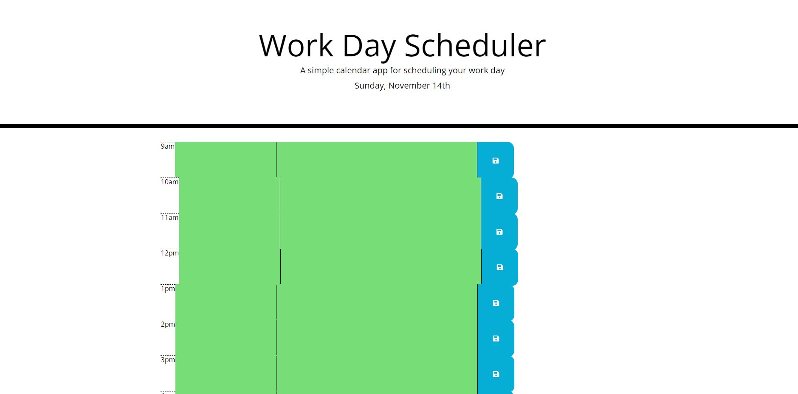

# 05 Third-Party APIs: Work Day Scheduler
This website allows you to plan out hourly events in your day and save any notes about those plans for later reference. The site also shows whether the event has occured in the past, present, or future.
 
 Image of the Website: 

https://namagaii.github.io/NR-Day-Planner/